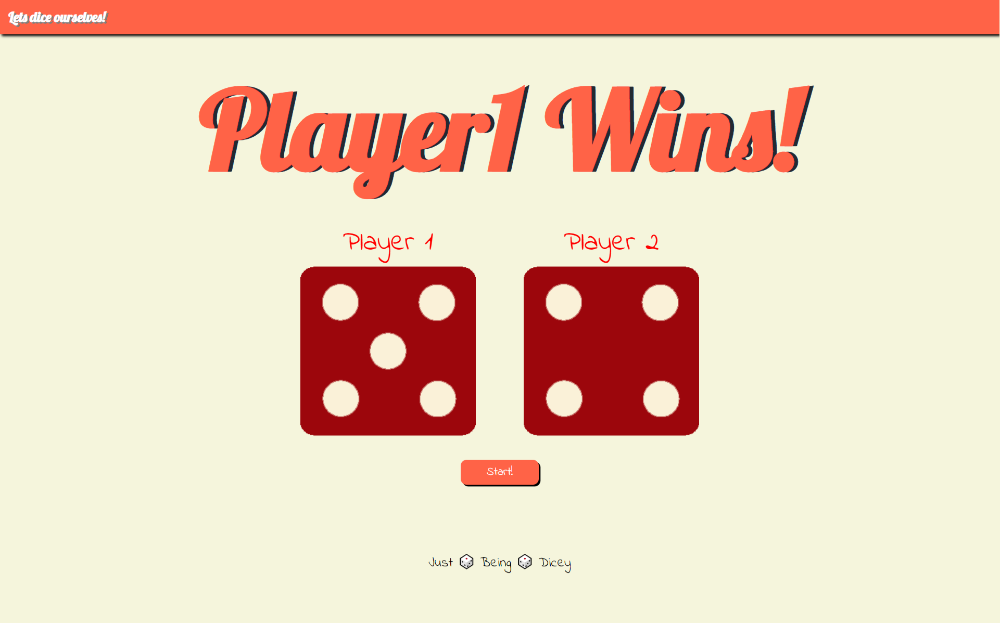

# The Basic Dice Game
Here we have a very basic Dice Game. 
In this, the one with the greater dice score is the winner. All we have to do is press on the start button, and a very simple code generates a random number for both the players. And the one having the greater score is the winner.

